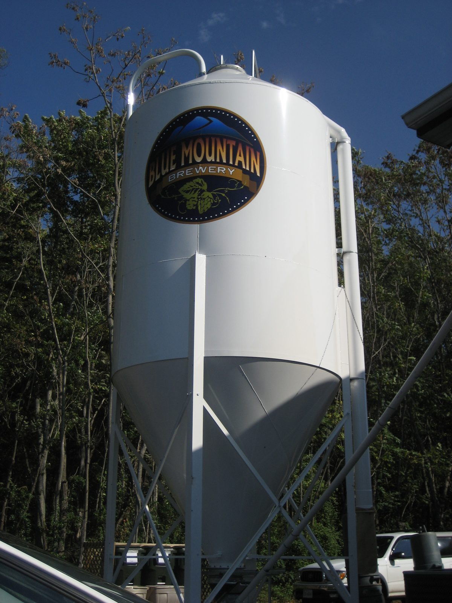

 ---
title: "Chemistry of Cheap Fermentation"
description: Reaction kinetics of a minimum-cost sugar wash, and the thermodynamic production cost every retail price in this course sits on top of
---

# Chemistry of Cheap Fermentation

## Week 1 — The Production Cost Baseline
**Dr. Marisol Quaye**



---

## Where the semester starts

- Raw thermodynamic cost of manufacturing
- Ethanol is an economic unit, not a biological one
- The tax, logistical margin, and spatial placement we map in Weeks 2 through 12 builds on this baseline
> if you do not calculate this initial number, the subsequent components cannot be measured

---

{/* _class: quote */}

> The raw thermodynamic cost of fermentation represents the absolute price floor of industrial ethanol. Any retail price observed above this floor is entirely a construct of taxation, logistical payload, and visual merchandising.
>
>
*Fermentation Kinetics of Ultra-Low-Cost Sugar Washes in High-Volume Beverage Production* (Smith & Davies, 2020)

---

## Learning objectives

By the end of this course you should be able to:

- Quantify the absolute price floor of industrial ethanol production
- Evaluate *Saccharomyces cerevisiae* metabolic efficiency in high-yield sugar washes
- Isolate the expenditure of downstream purification from the fermentation vat
- Analyse raw manufacturing costs and federal taxation categorizations

---

## The reaction, stated once

```text
C₆H₁₂O₆  →  2 C₂H₅OH  +  2 CO₂
glucose     ethanol      carbon dioxide
```

One mole of glucose yields two of ethanol. The stoichiometry is fixed and
uninteresting. **What varies is how fast a given wash gets there, and what
the substrate cost to buy.**

---

## The result that matters

Time to ethanol concentration:

| Substrate | Relative cost | Time to terminal ABV |
| :--- | :--- | :--- |
| Refined sucrose | Mid | Fast |
| Raw sugar | Low | Fast |
| Molasses | Lowest | Moderate |
| Fruit concentrate | Highest | Slowest |

Cost and rate are only **weakly correlated**, and the correlation that
does exist runs the wrong way from the intuition.

---

{/* _class: impact */}

# A cheaper wash is not a slower wash

---

## What actually limits the rate

Two variables, neither of them price:

- **nitrogen**: yeast needs it to build biomass before it can
  build ethanol; a nitrogen-poor wash stalls regardless of sugar present
- **isugar density**: too low and the yield caps early, too high
  and osmotic pressure suppresses the culture

Several of the least expensive substrates tested are nitrogen-rich as a
by-product of how they are refined. That is the whole mechanism.

---

## Why an economics course opens here

- Retail price is production cost **plus** tax **plus** margin **plus**
  whatever the shelf position is worth.
- These terms governs the effective retail price.

---

## Common errors

- Treating the production cost as a floor the retail price stays near —
  it frequently does not, and weeks 3 and 4 are about why
- Assuming a cheap input implies a cheap process

---

## Where this connects

- **week 2** converts alcohol volume into the standard-drink unit every
  later comparison is denominated in
- **week 3** takes the first real product — cask wine — and shows how
  little of its shelf price this baseline explains
- **week 12** returns here, at event scale, to ask the same question about
  a fifty-person inventory

---

## Next week

The standard drink as a unit of account: fixing the ten-gram ethanol
metric that every ratio, tax and comparison this semester is measured in.
