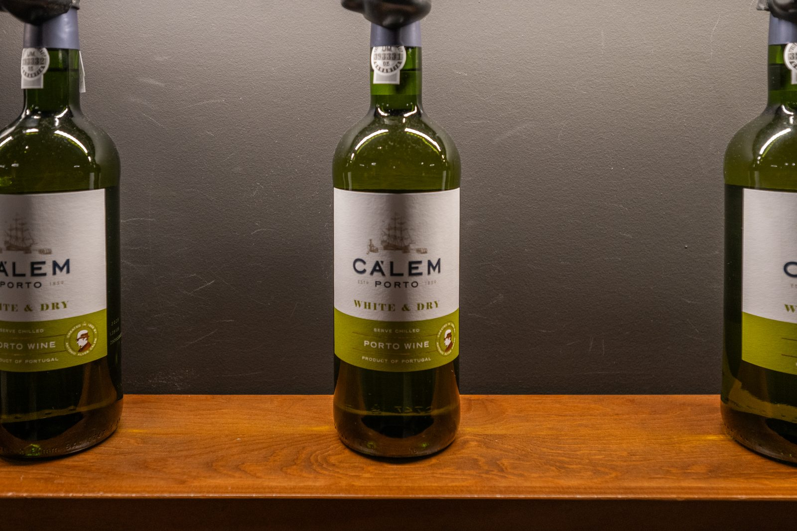

# Volumetric Tax Penalties

## Week 6 — The Other Design



*Photo: [Michael Gaylard](https://www.flickr.com/people/16564965@N04), [CC BY 4.0](https://creativecommons.org/licenses/by/4.0/), via [Wikimedia Commons](https://commons.wikimedia.org/wiki/File:Calem_White_%26_Dry_Porto_Wine_Bottles_(55242019592).jpg).*

---

## Where we left off

- Week 4: a tax on **value**, and a forty-fold gap in burden per drink
- the gap was structural, not a drafting error
- so the remedy has to be structural too
- this week: the design that does it, and its bill

---

{/* _class: quote */}

> Volumetric excise removes the arbitrage entirely. It does so by making
> every litre of alcohol cost the same in tax, which is both the point
> and the complaint.
>
> — *Volumetric Excise and the Distilled Spirits Premium* (Australian Tax
> Policy Journal, 2020)

---

## Learning objectives

By the end of this lecture you should be able to:

- state the volumetric base and compute litres of pure alcohol
- calculate excise payable for a product
- show why the per-standard-drink burden is flat under this design
- state the spirits premium as a number you derived

---

## The base

**Dollars per litre of pure alcohol.** Not per unit, not per dollar.

```
litres_of_alcohol = (volume_ml × abv_percent) / 100000
excise = litres_of_alcohol × rate_per_lal
```

Price does not appear anywhere in that calculation. That is the whole
difference from week 4.

---

## Three products, one rate

At an indicative $104.00 per litre of pure alcohol:

| Product | LALs | Excise | Per standard drink |
| :--- | ---: | ---: | ---: |
| Spirit, 700 mL, 40% | 0.280 | $29.12 | 131.8c |
| Beer, 375 mL, 4.8% | 0.018 | $1.87 | 131.8c |
| RTD, 375 mL, 4.5% | 0.017 | $1.76 | 131.8c |

---

{/* _class: impact */}

# Identical. To the tenth of a cent.

---

## Why it must come out flat

- the tax base is litres of pure alcohol
- a standard drink **is** a fixed mass of pure alcohol
- so tax per standard drink is the rate times a constant
- the flatness is arithmetic, not policy design succeeding

Compare week 4, where the same exercise produced 1.8c against 72.6c.

---

## The bill: the spirits premium

Closing the arbitrage is not free.

- that flat 131.8c sits **well above** wine's effective burden under WET
- spirits therefore carry a markedly heavier per-drink tax than wine
- the reading calls this the **spirits premium**
- it is the price of removing the cheap-product loophole, paid by one
  category

---

## Which regime is a bottle under?

You cannot tell from the shelf price. You can only tell by decomposing:

- production cost (week 1)
- packaging and freight (week 3)
- **category tax** (weeks 4 and 6)
- margin, by difference

Same decomposition, applied category by category. That is the method.

---

## Common errors

- dividing by 1000 rather than 100000 when computing LALs
- quoting the reading's premium figure instead of deriving your own
- reading "flat per standard drink" as "fair" — the lecture claims the
  first and not the second
- assuming one regime is simply better; each buys something and charges
  for it

---

## Where this connects

- the **WET Policy Brief** is due next week and wants this comparison
- the **week 6 lab** puts all seven of your products on one axis
- the **toolkit's tax comparator** runs both regimes on one product,
  which is the fastest way to check your own working

---

## Next week

Where the product sits in the shop — and what that position costs the
person who walks to it.
