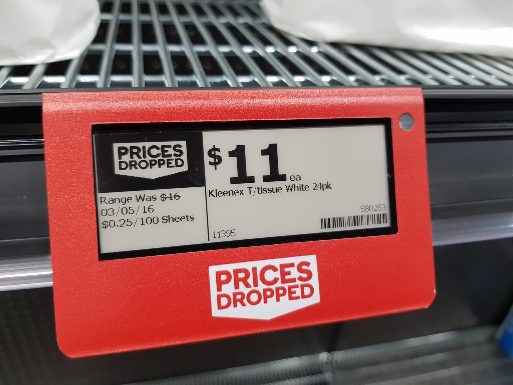

# Data Scraping Methodologies

## Week 9 — A Hundred SKUs



*Photo: [Maksym Kozlenko](https://commons.wikimedia.org/wiki/User:Maxim75), [CC BY-SA 4.0](https://creativecommons.org/licenses/by-sa/4.0/), via [Wikimedia Commons](https://commons.wikimedia.org/wiki/File:2021-06-28_E-ink_price_tag_in_Sydney_supermarket.jpg).*

---

## Where we left off

- Eight weeks of arguing that one shelf price hides more than it shows
- every one of those arguments was made one product at a time
- a case study cannot distinguish a pattern from a coincidence
- this week: the tool for checking the claim at scale

---

{/* _class: quote */}

> None of the failure modes we document announce themselves. Each
> produces a dataset that loads, parses, and ranks — and is wrong in a way
> that survives inspection.
>
> — *Automated Extraction of Supermarket Inventory Data* (Journal of
> Computational Retail Analysis, 2023)

---

## Learning objectives

By the end of this lecture you should be able to:

- extract and normalise name, volume, ABV and price into one schema
- name the four silent failure modes and detect each
- say why roughly a hundred SKUs is the threshold
- separate a category pattern from one retailer's promotions

---

## Conduct first

- check `robots.txt` before writing the first request
- a crawl delay of **at least two seconds**
- identify your client honestly
- stop if the terms of service say to

This is a course rule on the policies page. It is also what separates a
method another researcher could repeat from one that gets an IP range
blocked for the whole cohort.

---

## The schema

Four fields, one row per SKU:

```
name | volume_ml | abv_percent | price_dollars | scraped_at
```

`scraped_at` is not optional. Week 5 established that RTD prices move on
a cycle; a row without a timestamp cannot be placed on it.

---

{/* _class: impact */}

# Every failure mode here loads cleanly

---

## The four

- **volume lives in the title, not a field** — `750ml` parses, `75cl`
  and `6x330` do not, until you make them
- **ABV missing entirely** — common on beer, near-universal on
  multipacks; inferring is allowed, recording that you inferred is
  required
- **promotional price in the price field** — it changes under you between
  runs
- **the same product listed twice** at different sizes, double-counting
  unless you key on something better than name

---

## Why a hundred

Below roughly a hundred SKUs, the reading finds you cannot distinguish:

- a genuine **category-wide** pattern, from
- noise in one retailer's **current promotional calendar**

That threshold is why the Data Scraping Exercise sets the number it does.
It is a statistical floor, not an arbitrary workload.

---

## The honest column

Add one field recording, per row, whether ABV was **stated or inferred**.

The assessment's reproducibility criterion is largely about whether a
reader can tell your measured data from your assumed data. A column is
the cheapest way to let them.

---

## Common errors

- scraping once and treating the result as the standard price
- dropping rows with missing ABV, which silently biases the set toward
  the categories that publish it
- normalising volume but not multipack count
- reporting 100 rows when 30 of them are the same product

---

## Where this connects

- **week 10** ranks and optimises over exactly this dataset
- the **week 9 lab** gets your scraper returning its first hundred rows
- the **Data Scraping Exercise** is marked hardest on calculation
  accuracy, because a large wrong dataset is worth less than a small
  right one

---

## Next week

The formula that scores the dataset, and why a greedy ranking stops being
optimal the moment a budget exists.
